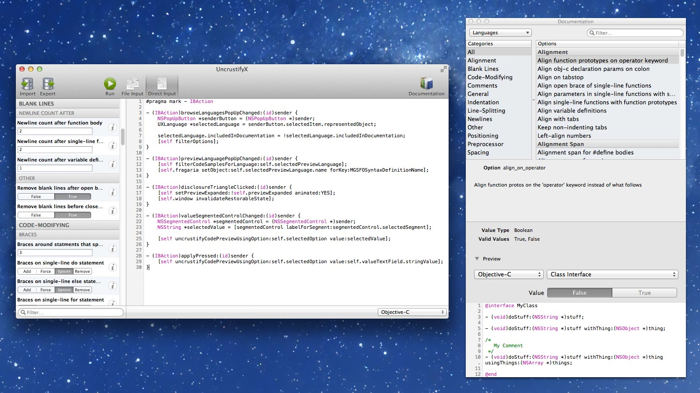

# UncrustifyX
[Uncrustify](http://uncrustify.sourceforge.net) utility and documentation browser for Mac OS X

## Purpose
UncrustifyX aims to make it easier to browse the hundreds of options available for the Uncrustify utility. 
The documentation browser categorizes the options and provides easy searching and filtering. It can also show a live preview of applying an option on a code sample. 

Additionally, UncrustifyX allows importing and exporting of Uncrustify .cfg files, and provides a GUI to run a configuration set on a list of files, or direct source code input.

## 2-Sentence Manual
Drag options from the documentation panel into the main window's option table. 
Drag source files (.h, .m etc.) onto the dock icon, or into the main window's file table. 

No preset configuration files are currently included. [Here](https://gist.github.com/4242629) is a good starting point for an Objective-C configuration.

## Download
Prebuit binaries and source are available on the [releases page](https://github.com/ryanmaxwell/UncrustifyX/releases), and tagged releases can be easily updated to via Sparkle in-app updates.

## Building Project
Git checkout the project including its submodules. Xcode 4.5+, 10.8+ required. Install [mogenerator](http://rentzsch.github.com/mogenerator/). Install [NSLogger](https://github.com/fpillet/NSLogger) to view debug logging.

## Contribution
I welcome contributors to this project. Raise any bugs/suggestions/feature requests within the Issues tab.
File bugs on uncrustify at the project's [SourceForge](http://sourceforge.net/projects/uncrustify/) or [Github](https://github.com/bengardner/uncrustify) home.

### Configuration Set Contribution
I plan to add some default config files in the future. If you have a particulary fine-tuned config file for a language, please get in touch. 

## Xcode Integration
The best way to use your uncrustify configuration from within Xcode is by using [BBUncrustifyPlugin-Xcode](https://github.com/benoitsan/BBUncrustifyPlugin-Xcode). This is bundled with UncrustifyX and you can install it from the Preferences window. 

## License
UncrustifyX is licenced under a [modified BSD License](https://github.com/ryanmaxwell/UncrustifyX/blob/master/LICENSE). 
Please don’t upload this code directly to the App Store as is, without making substantial improvements. In other words, please don’t be a jerk.